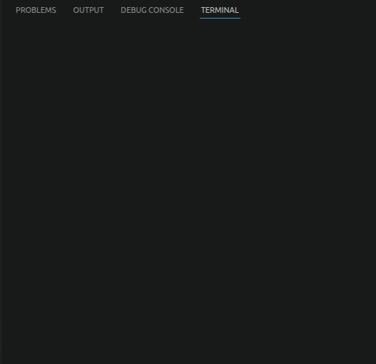
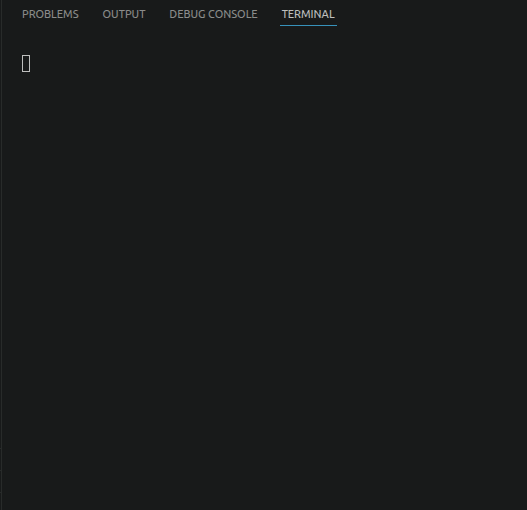
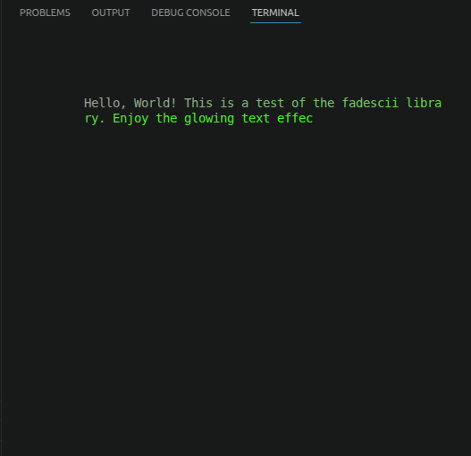
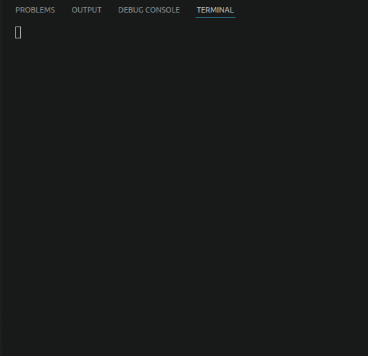
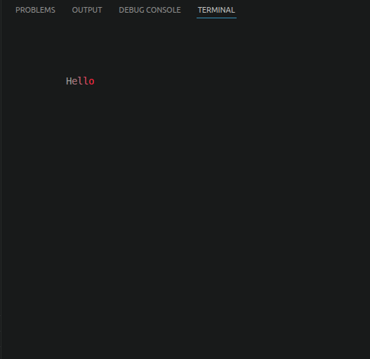
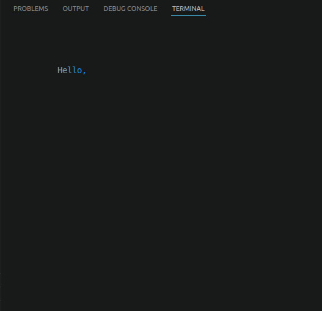
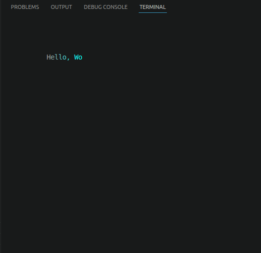
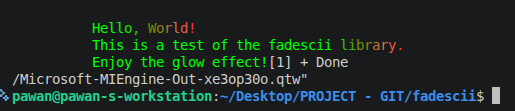

# Fadescii

<div align="center">


**Text that doesn't just appear — it arrives.**


*A lightweight C++ terminal text-animation library with temporal color,
glowing trails, and character-by-character rendering.*


</div>

---

# Quick Demos:

<table>
  <tr>
    <td></td>
    <td></td>
    <td></td>
  </tr>
  <tr>
    <td></td>
    <td></td>
    <td></td>
  </tr>
  <tr>
    <td></td>
    <td></td>
    <td></td>
  </tr>
  <tr>
    <td></td>
    <td></td>
    <td></td>
  </tr>
</table>

---

## Important Note

Fadescii is designed for **POSIX terminals** (Linux, macOS, BSD, WSL) and requires **ANSI escape codes** and **24-bit true-color support**.

### Zero-Dependency Version

The **absolute-zero-dependency version contains no POSIX-specific code**, so it can also be used on Windows, Android, or other platforms.

The only requirements are:

* ANSI escape code support
* 24-bit true-color support
* Providing the **terminal size (rows, columns)** before drawing

Terminal-size detection is left to the application, since each platform provides different ways to obtain it. You can use **Windows APIs, POSIX APIs, Android APIs, or any other method** appropriate for your environment.

**Fadescii handles the rendering; how you obtain the terminal size is up to you.**

---

## 📖 Table of Contents

- [Overview](#-overview)
- [Features](#-features)
- [The Two Modes](#-the-two-modes)
- [Architecture](#-architecture)
- [Quick Start](#-quick-start)
- [Use Cases](#-use-cases)
- [Why Fadescii](#-why-fadescii)
- [Comparison](#-comparison)
- [Design Philosophy](#-design-philosophy)
- [License](#-license)

---

## 🌟 Overview

Fadescii is a lightweight C++ library for expressive terminal text animation. It renders text character by character, using temporal color transitions, glowing trails, and configurable animation timing. It takes a plain string and a rectangle on your terminal — and instead of printing the text, it *draws* it. Character by character. Cell by cell. With a glowing trail that follows behind each letter as it lands on screen.

The name is a collision of two ideas: **"fade"** and **"ASCII"**. The glow fades into the text color as it settles. The terminal turns from a place where text is *printed* into a place where text is *performed*.

### Why Text Animation?

Terminals are fast, sharp, and everywhere. But plain `printf` is flat. Text appears — done — no weight, no motion, no presence. Fadescii gives that text presence.

- **Zero Dependencies** — No libraries. No frameworks. No linker headaches. Just C++ and the terminal you're already sitting in.
- **Self-Contained** — One class. One behavior. One thing done well.
- **True Color** — Full 24-bit RGB, so your glow can be any shade you want it to be.
- **Retro-meets-modern** — The grid is old. The glow is new.
- **Meant to be tuned** — Speed, colors, glow length. All exposed. All waiting for you.

---

## ✨ Features

### 🎨 Rich Color Control
- **24-bit True Color** — Full RGB spectrum, no compromise
- **Hex Color Support** — `#FF5733` format
- **RGB Function Support** — `rgb(255,87,51)` format
- **Independent Text & Glow Colors** — The trailing glow can be a completely different color from the settled text

### 🚀 Animation
- **Two Glow Modes** — Classic fade, and shimmer
- **Character-by-Character Drawing** — Every letter lands individually
- **Adjustable Speed** — Control how fast each character is drawn
- **Adjustable Glow Length** — From no trail at all, to a long comet tail
- **Automatic Line Wrapping** — Text wraps inside the box automatically
- **Clean Exit** — Restores the terminal when finished

### 🧩 Developer-Friendly
- **Simple Setup** — Define a box, set colors, draw text
- **Safe by Default** — Bounds-checked drawing, no out-of-box writes
- **No Config Files** — Everything is set in code
- **Automatic Cleanup** — Hides cursor during draw, restores after

---

## 🎭 The Two Modes

Fadescii has **two personalities**. You pick one per call.

### ▸ Classic Glow — *The Comet*

Each character fades smoothly from the glow color into the text color as it settles. The trail behind the cursor looks like the tail of a comet — bright at the head, fading into the text color at the tail.

**Feels like:** neon signs flickering on, embers cooling into shape.

```cpp
engine.drawText("Hello, terminal.");
```

### ▸ Shimmer Glow — *The Wave*

The glow doesn't stay one color. It pulses between a darker and a brighter shade of the glow color as it trails behind each character — creating a shimmering, wave-like effect that ripples across the text.

**Feels like:** light reflecting off water, chrome catching the sun.

```cpp
engine.drawTextShimmer("Hello, terminal.");
```

Both modes wrap text inside the box, handle `\n`, and clean up after themselves when the animation finishes.

---

## 🏗 Architecture

```
┌─────────────────────────────────────────────────────────────┐
│                      Application Layer                      │
│   ┌──────────────┐  ┌────────────────┐  ┌───────────────┐  │
│   │  drawText()  │  │ drawTextShimmer│  │  setColors()  │  │
│   └──────────────┘  └────────────────┘  └───────────────┘  │
└─────────────────────────────────────────────────────────────┘
                            ↓
┌─────────────────────────────────────────────────────────────┐
│                     Animation Layer                         │
│   ┌────────────────────────────────────────────────────┐   │
│   │   Character Buffer  •  Cursor Advance  •  Timing   │   │
│   └────────────────────────────────────────────────────┘   │
└─────────────────────────────────────────────────────────────┘
                            ↓
┌─────────────────────────────────────────────────────────────┐
│                     Color Layer                             │
│   ┌────────────────────────────────────────────────────┐   │
│   │  Text Color  →  Glow Color  →  Interpolation       │   │
│   └────────────────────────────────────────────────────┘   │
└─────────────────────────────────────────────────────────────┘
                            ↓
┌─────────────────────────────────────────────────────────────┐
│                     Terminal Layer                          │
│   ┌────────────────────────────────────────────────────┐   │
│   │   Cursor Positioning  •  Foreground Color          │   │
│   │   Bounds Checking     •  Clean Exit                │   │
│   └────────────────────────────────────────────────────┘   │
└─────────────────────────────────────────────────────────────┘
                            ↓
                    Terminal Display
```

Fadescii draws directly to the terminal. There's no intermediate grid, no frame buffer, no render pass — just characters landing on screen with color applied as they arrive.

---

## 🚀 Quick Start

### Prerequisites

- **C++11 or higher** compiler
- **POSIX terminal** — Linux, macOS, BSD, WSL
- **24-bit true color support** — Most modern terminals handle this

### Installation

```bash
# Clone the repository
git clone https://github.com/intriXlabs/Fadescii.git

# Compile with optimizations
g++ -O3 -std=c++11 fadescii_demo.cpp -o fadescii

# Run the demo
./fadescii
```

### Minimal Example

```cpp
#include "fadescii.cpp"

int main() {
    fadescii engine;

    // Define a box: row, col, height, width
    engine.initialize(2, 4, 10, 60);

    // Set the final text color (hex)
    engine.setTextColor("#FFFFFF");

    // Set the glow color that trails behind
    engine.setGlowColor("rgb(255, 0, 100)");

    // Speed and glow length
    engine.setSpeed(0.05);      // seconds per character
    engine.setGlowLength(6);    // how long the trail is

    // Animate
    engine.drawText("Text that doesn't just appear — it arrives.");

    return 0;
}
```

---

## 🎯 Use Cases

### 1. Terminal Splash Screens
Greet users with a name, banner, or quote that feels *crafted* — not just printed.

```cpp
engine.setGlowColor("#00FFAA");
engine.drawTextShimmer("Welcome to the grid.");
```

### 2. CLI Tools & Installers
Boot sequences, setup wizards, and first-run experiences that stand out from every other tool in the terminal.

### 3. Terminal Games
Dialogue boxes, cutscenes, death screens, victory messages — anywhere a character's words should land with weight.

### 4. Live Demos & Streams
Text that draws the eye on screen. Perfect for OBS overlays, recordings, or anything that needs motion.

### 5. Personal Projects
Anywhere a plain `printf` feels too flat. Banners, log headers, ASCII art with a soul.

---

## 🌈 Why Fadescii

Most terminal projects fall into one of two camps: they print text, or they build a whole TUI framework. Fadescii sits in between.

It doesn't want to render a full interface. It doesn't want to manage input. It doesn't want to own your terminal. It just wants to make **one thing** feel alive — and then get out of the way.

If you're printing text and you want people to **look** at it — this is what it's for.

---

## ⚖️ Comparison

| | **Fadescii** | Plain `printf` | Full TUI Libraries |
|---|---|---|---|
| **Dependencies** | None | None | Several |
| **Setup** | One class | Trivial | Framework to learn |
| **Animation** | Character-by-character glow | None | Possible, manual |
| **Color Control** | Full RGB + glow | ANSI only | Varies |
| **Scope** | Text animation only | Print only | Full-screen UI |
| **Feel** | Alive, cinematic | Static | Functional, boxy |
| **Learning curve** | Minutes | Seconds | Hours to days |

Fadescii isn't trying to replace your TUI library. It's trying to make the text *inside* it land harder.

---

## 🧬 Design Philosophy

Fadescii is small on purpose.

- It doesn't try to be a rendering engine.
- It doesn't try to be a framework.
- It doesn't ask you to adopt a build system, a config file, or a new way of thinking.

It's one class that does one thing well.

Speed, colors, glow length — these aren't buried constants. They're exposed, documented, and waiting for you to tune them. You're *supposed* to reshape it.

---

## things to be noticed
the '\n' does make character does a specific things which is recorded algorithm behiviour: give in image - it leaves color before '\n'
so color only ends cleanly if the function had completely finished it's rendering. otherwise the effect is in image.



---

## 📄 License

Licensed under the MIT License. See [LICENSE](LICENSE) for details.

---

<div align="center">

**Built for the terminal.**

*"A character lands. A glow follows. The screen remembers."*

[⬆ Back to Top](#fadescii)

</div>